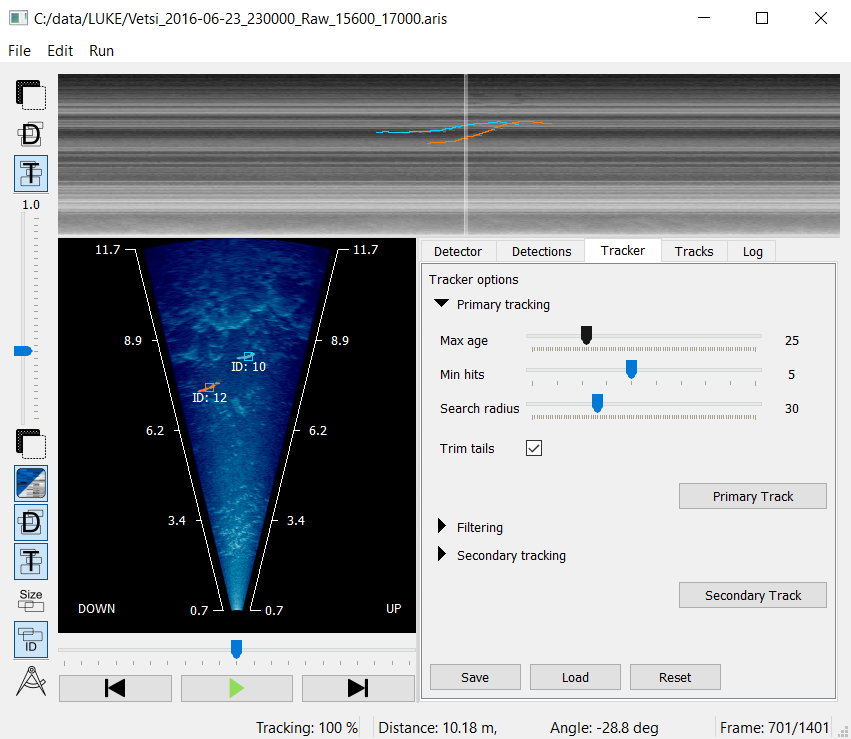

# Fish Tracker

Fish Tracker is an application for semi-automatic tracking and counting of fish in a sonar video. This is a functioning program but also under development.



## Run with Python

First, you need to install `uv` which is a package manager for Python. It can be installed by [following the official instructions](https://docs.astral.sh/uv/getting-started/installation/).

Run the application with:

```bash
uv run main.py
```

This will open the application.

## Run `batch_track.py from command line

To run the `batch_track.py` script copy the `configs/example.default.yaml` and rename it to `default.yaml`. This file contains the default parameters for the script. You can modify the parameters in this file to suit your needs.

If you want to run the `batch_track.py` script from the command line, you can do so by using the following command:

```bash
uv run batch_track_cli.py --input.file_paths="[file1.aris,file2.aris]" --output.directory="/my/custom/output/path"
```

This command will process the input file and save the results to the output file. The input file should be a sonar video file, and the output file will contain the detection, tracking results and the .fish files. Keep in mind that these parameters will override the default values set in the `configs/default.yaml` file.

In addition, you change different parameters in the `configs/default.yaml` file, such as the tracking and detection paramteres.

## Quickstart guide

1. Open \*.aris file by choosing "File"&#8594;"Open...". Previously saved results (\*.fish files) can be opened by choosing "File"&#8594;"Load..."
2. The application computes a background model for background subtraction and an echogram. The progress of the application is printed on the "Log" tab.
3. A vertical line seen in the echogram indicates the currently selected frame, which can be freely selected. The view can be zoomed with the scroll wheel and panned with the right mouse button.
4. The quality of the background subtraction can be inspected by choosing the "Background subtraction" icon (topmost icon on the left-hand side of the sonar view).
5. If fish seem to disappear from the view, it is recommended to lower the value of the "MOG var threshold" parameter. To confirm the changes, press "Apply Values".
6. ”Calculate all” computes all detections for the entire data. "Log" tab can be used to follow the progress.
7. "Detections" tab lists all detections in the currently selected frame.
8. Detections are combined into counted fish at the "Tracker" tab by choosing "Primary Track". "Log" tab can be used to follow the progress.
9. "Tracks" tab lists all the tracked fish from the entire file. The fish list can be edited if needed (change lengths, remove fish, combine paths, etc.)
10. Final results can be saved to a file by choosing "File"&#8594;"Save as...".
11. Detections and tracks can be exported to separate \*.csv files by choosing "File"&#8594;"Export detections..." and "File"&#8594;"Export tracks...".

## Bundle and create installer (Windows)

PyInstaller can be used to bundle the source code into a single package with all the required dependecies. The following command does this based on the configuration file "fish_tracker.spec". At the project root, run:

```
pyinstaller fish_tracker.spec
```

or

```
pyinstaller fish_tracker.spec --noconfirm
```

so the removal of the previous bundle does not have to be confirmed.

The resulting bundle can be found in the "dist" folder. It includes an executable, "fish_tracker.exe", which can be used to run the program.
For easier distribution, an installer can be created using a program called NSIS or similar.

## TODOs

### Fix Ruff errors

When running `uvx ruff check --statistics` the following errors are reported, but these will be ignored in the `pyproject.toml` file. They should be fixed in the future.

| Count | Code   | Description                              |
| ----- | ------ | ---------------------------------------- |
| 217   | F405   | `undefined-local-with-import-star-usage` |
| 39    | PTH123 | `builtin-open`                           |
| 29    | F841   | `unused-variable`                        |
| 25    | PTH118 | `os-path-join`                           |
| 22    | A002   | `builtin-argument-shadowing`             |
| 21    | A001   | `builtin-variable-shadowing`             |
| 17    | F403   | `undefined-local-with-import-star`       |
| 14    | E722   | `bare-except`                            |
| 11    | PTH109 | `os-getcwd`                              |
| 9     | PTH110 | `os-path-exists`                         |
| 7     | PTH111 | `os-path-expanduser`                     |
| 7     | F821   | `undefined-name`                         |
| 6     | PTH100 | `os-path-abspath`                        |
| 6     | PTH120 | `os-path-dirname`                        |
| 5     | PTH119 | `os-path-basename`                       |
| 4     | B008   | `function-call-in-default-argument`      |
| 3     | PTH202 | `os-path-getsize`                        |
| 2     | PTH102 | `os-mkdir`                               |
| 2     | PTH122 | `os-path-splitext`                       |
| 1     | PTH112 | `os-path-isdir`                          |
| 1     | PTH207 | `glob`                                   |

## Copyright

Copyright 2025, Norwegian Institute for Nature Research.

This program is licensed under GNU General Public License version 3.

The above copyright notice and this license notice shall be included in all copies or substantial portions of the Software.

THE SOFTWARE IS PROVIDED "AS IS", WITHOUT WARRANTY OF ANY KIND, EXPRESS OR
IMPLIED, INCLUDING BUT NOT LIMITED TO THE WARRANTIES OF MERCHANTABILITY,
FITNESS FOR A PARTICULAR PURPOSE AND NONINFRINGEMENT. IN NO EVENT SHALL
THE AUTHORS OR COPYRIGHT HOLDERS BE LIABLE FOR ANY CLAIM, DAMAGES OR OTHER
LIABILITY, WHETHER IN AN ACTION OF CONTRACT, TORT OR OTHERWISE, ARISING FROM,
OUT OF OR IN CONNECTION WITH THE SOFTWARE OR THE USE OR OTHER DEALINGS IN
THE SOFTWARE.

The following pieces of software have additional or alternate copyrights,
licenses, and/or restrictions:

| Program                                                        | Files                                                                                                                                                                                                       |
| -------------------------------------------------------------- | ----------------------------------------------------------------------------------------------------------------------------------------------------------------------------------------------------------- |
| [Fish Tracking](https://github.com/minamaged113/fish-tracking) | [/ file_handlers / \*](file_handlers/)<br/> [/ UI / icons / \*](UI/icons)<br/> [/ file_handler.py](file_handler.py) <br/> [/ iconsLauncher.py](iconsLauncher.py) <br/> [/ sonar_widget.py](sonar_widget.py) |
| [Sort](https://github.com/abewley/sort)                        | [/ sort.py](sort.py)                                                                                                                                                                                        |
